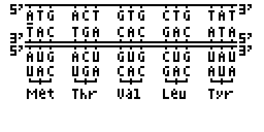

# casio_dna_to_rna_converter 
converts parts of DNA to m-RNA and t-RNA

## Installation

Connect Casio fx-9860 GIII or GII to your Computer with the help of the USB cable. 
Press [F1] 
 
Open the file manager of your operating system and insert the DNA.G1A file into  
the shown device (usually D:). 
 
Eject device (usually D:). More info on calculator display. 
 
Press [EXE] as shown on the screen. 
Press [EXIT] as shown on the screen. 
Press [MENU] as shown on the screen. 
 

# Use
to modify the first DNA strand use

[DEL] to delete a character 
 
[4] for A Adenin 
[1] for T Thymin/ U Uracil 
[6] for G Guanin 
[3] for C Cytosin 
 
[LEFT] go one to the left 
[RIGHT] go one to the right 
[UP] go one strand up 
[DOWN] go one strand down 

